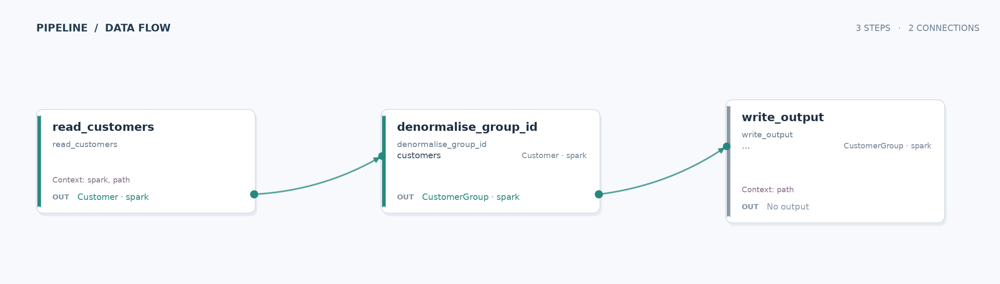

# Customer groups

Learn how a Data Joinery pipeline can enrich records with a self-join while checking the shape of every DataFrame.

## Run

From the repository root, run `just run-example customer_group`. The example reads the included parquet fixture and writes `customer_group_example/__output/output.parquet`.

## Pipeline

| Stage | What happens |
| --- | --- |
| Input | `data/customers.parquet` supplies customer IDs, names, and optional parent customer IDs. |
| Transform | `denormalise_group_id` joins each customer to its parent and adds `parent_name`. Customers without a matching parent remain in the result. |
| Output | The enriched rows are displayed and written as parquet to `__output/output.parquet`. |

**What this demonstrates:** `Strict` contracts validate the source and enriched schemas, and a left self-join turns a parent ID into a readable group name.
