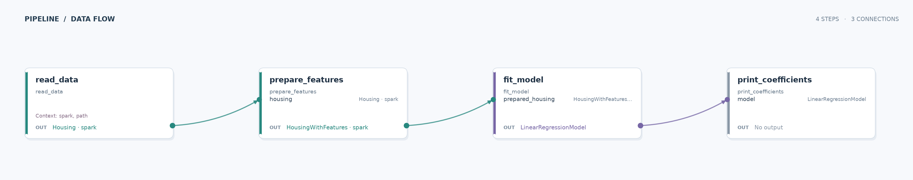

# Housing linear regression

Learn how a Data Joinery pipeline can pass a fitted Spark ML model between typed steps.

## Run

From the repository root, run `just run-example housing_linear_regression`. The example reads the included parquet fixture and prints the fitted coefficients and intercept.

## Pipeline

| Stage | What happens |
| --- | --- |
| Input | `data/housing.parquet` contains bedroom counts, square footage, and prices. |
| Transform | Spark assembles the two numeric features, then fits a linear regression model to price. |
| Output | `print_coefficients` displays the model coefficients and intercept; this pipeline writes no file. |

**What this demonstrates:** DataFrame contracts validate feature preparation, while a model object flows from one pipeline step to another.
