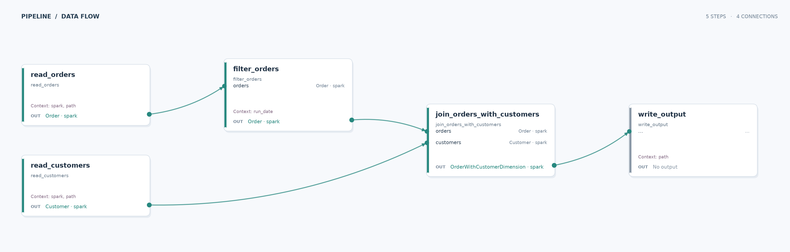

# Orders and customers

Learn how a Data Joinery pipeline combines two inputs and injects a run date into a transformation.

## Run

From the repository root, run `just run-example order_product`. The example uses the included parquet fixtures, selects orders from **2026-01-01**, and writes `order_product_example/__output/output.parquet`.

## Pipeline

| Stage | What happens |
| --- | --- |
| Inputs | `data/orders.parquet` contains dated orders; `data/customers.parquet` contains customer names. |
| Transform | `filter_orders` keeps the run date's orders. `join_orders_with_customers` joins those orders to customers by `customer_id`. |
| Output | The enriched orders are displayed and written as parquet to `__output/output.parquet`. |

**What this demonstrates:** A graph can join independent source branches, validate their DataFrame contracts, and receive runtime configuration through context.
