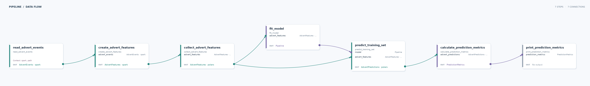

# Spark to scikit-learn

Learn how a Data Joinery pipeline can move a small aggregated dataset between DataFrame backends and pass a model between steps.

## Run

From the repository root, run `just run-example sklearn_spark`. The example reads the included parquet fixture and prints training-set prediction metrics.

## Pipeline

| Stage | What happens |
| --- | --- |
| Input | `data/advert_events.parquet` contains timestamped advert search and view events. |
| Transform | Spark counts each event type by date and advert. The aggregated features are collected into Polars; scikit-learn fits a linear regression model and predicts the same rows. |
| Output | The pipeline calculates and prints mean absolute error, mean squared error, and R². It writes no file. |

**What this demonstrates:** Contracts span Spark and Polars DataFrames, and typed Python values carry the fitted model and metrics through the graph. The metrics describe the training data, not held-out performance.
