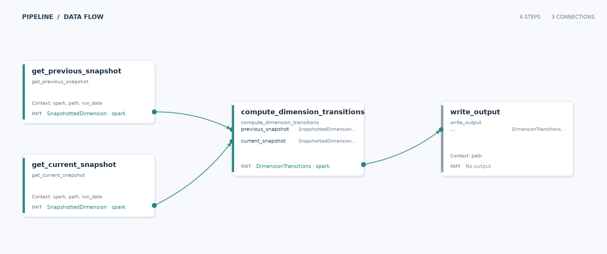

# Snapshot transitions

Learn how a Data Joinery pipeline compares two daily snapshots through separate branches of one source.

## Run

From the repository root, run `just run-example snapshot_diff`. The example compares **2025-12-31** with **2026-01-01** in the included parquet fixture and writes `snapshot_diff_example/__output/output.parquet`.

## Pipeline

| Stage | What happens |
| --- | --- |
| Input | `data/snapshotted_dimension.parquet` contains dated entity attributes and their update timestamps. |
| Transform | Two reader steps select the previous and current dates. `compute_dimension_transitions` pairs rows by entity and places the prior values beside the current values. |
| Output | The paired rows are displayed and written as parquet to `__output/output.parquet`. Entities without a prior row are omitted; unchanged pairs are included. |

**What this demonstrates:** Named connections route two same-schema inputs into distinct transform parameters, with the run date supplied by context.
